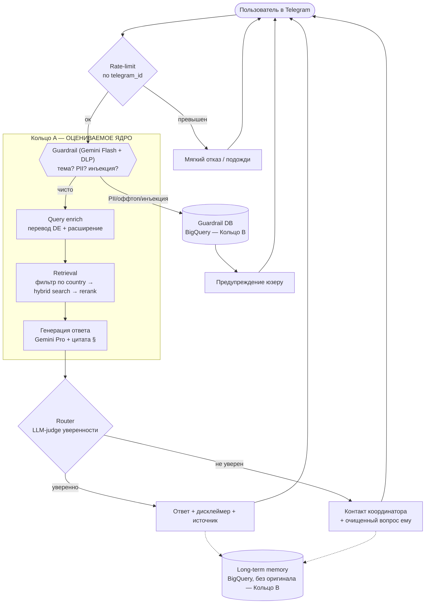

# Обзор идеи, материалов и потока

> Закрывает твои запросы: «общая оценка идеи и материалов» + «проверка моего потока и предложения по изменениям».

---

## Часть 1. Оценка идеи

### Что хорошо (сильные стороны для оценки)

1. **Настоящая проблема с настоящей болью.** Беларусские беженцы реально теряются в чужом праве на чужом языке. В задании прямо просят проблему «from your work or daily life». У тебя она живая, не выдуманная — это плюс к разделам 1 (5%) и 5 (питч, 10%), где ценят историю и эмпатию.

2. **RAG-shaped задача в чистом виде.** Это ровно тот случай, под который RAG создан: большой корпус неизменных документов (законы) + вопросы, ответы на которые ДОЛЖНЫ опираться на источник, а не на фантазию модели. Юридическая сфера = высокая цена галлюцинации = grounding обязателен. Это твой главный аргумент «почему RAG, а не просто ChatGPT».

3. **У тебя уже есть эталонный тест-сет.** 13 пар «вопрос-ответ» на русском с реальными ответами от человека (Анастасия). Большинство студентов на этой стадии не имеют ничего. Это твой фундамент для Evaluation. Бытовая аналогия: ты строишь робота-повара и у тебя СРАЗУ есть 13 блюд от шеф-повара, с которыми можно сравнивать. Огромная фора.

4. **Этичный дизайн (no-PII) — это не только правильно, но и продаётся.** «Мы принципиально не храним персональные данные беженцев» — это сильный слайд в питче и реальное конкурентное преимущество (беженцы боятся слежки). Хорошо, что ты думаешь об этом с самого начала.

### Что вызывает риски (честно)

1. **Объём.** Уже сказал в `00`: 7 узлов + 3 вида памяти + баны + DDOS + human-handoff соло за неделю не делаются до продакшн-качества. Риск — размазать силы и не довести RAG (50% оценки) до измеримого результата.

2. **Cross-lingual разрыв.** Законы — на немецком, кейсы — на русском, вопросы — на русском/белорусском, эталонные ответы — на русском. Это технически интереснее обычного RAG, но и сложнее: эмбеддинг должен «понимать», что русский вопрос про ВНЖ и немецкий §NAG — про одно и то же. Это решаемо (см. `03`), но это риск для accuracy, и его надо измерять отдельно.

3. **Юридическая ответственность.** Ты даёшь людям советы по праву. Нужен явный дисклеймер («это не юридическая консультация, проверьте у специалиста») и роутинг сложных случаев к человеку. Хорошо, что роутинг к координатору у тебя уже в схеме — это закрывает риск и этически, и в глазах преподавателя.

4. **Качество корпуса = потолок качества ответов.** Сейчас «Court decisions» пустая, по Литве данных нет, законы лежат как PDF/RTF (не самый дружелюбный для RAG формат). RAG не умнее своих документов. Об этом — в Части 2.

### Вердикт по идее

Идея — одна из лучших, что можно выбрать под это задание: реальная, RAG-естественная, с готовым тест-сетом и сильной этической историей. Главная угроза не в идее, а в дисциплине scope. Делай ядро, не гонись за всеми узлами.

---

## Часть 2. Оценка подготовленных материалов

Что лежит в `docs/Austria` на сейчас:

| Папка / файл | Содержимое | Состояние | Замечание |
|---|---|---|---|
| `Laws/` | NAG, FPG §88, StbG — законы (немецкий) | PDF + RTF + xlsx источников | Основа корпуса. Формат надо нормализовать (см. `03`). |
| `Cases/` | 2 обезличенных кейса, русский | docx | Ценно: связывает «сухой закон» с «живой ситуацией». Отличный материал для chunking с контекстом. |
| `Court decisions/` | — | **пусто** | Либо наполнить, либо честно отметить как «вне scope POC». |
| `Test Qs.xlsx` | 13 пар Q&A, русский | заполнено | Твой golden set. Маловато для статистики, но достаточно для POC. Расширить до ~30-50 синтетикой. |
| `Weblinks.docx`, `Sources.xlsx` | ссылки на первоисточники (RIS, JUSLINE) | есть | Пригодится для NotebookLM (см. `05`) и для метаданных «источник». |

Рекомендации по материалам:

1. **13 вопросов — рабочий минимум, но расширь до 30-50.** Как: прогони законы через Gemini с промптом «сгенерируй реалистичные вопросы беженца + ответ строго по этому тексту со ссылкой на параграф». Получишь синтетический eval-set. Важно: синтетику держи ОТДЕЛЬНО от 13 «человеческих» — человеческие это твой «святой» бенчмарк, синтетика — для объёма. (Аналогия: 13 экзаменационных задач от профессора + 40 задач из задачника для тренировки. Не смешивай.)

2. **Нормализуй законы из PDF/RTF в Markdown с сохранением структуры параграфов (§).** Юридический текст держится на иерархии «§ → абзац → пункт». Если chunking порвёт §88 пополам — ответ будет неполным. PDF плохо отдаёт структуру; см. инструменты в `03`.

3. **Метаданные — твоё двухступенчатое преимущество.** Ты правильно задумал: сначала фильтр по стране, потом поиск внутри. К каждому документу/чанку добавь метаданные: `country` (AT), `doc_type` (law/case/decision), `law_code` (NAG/FPG/StbG), `paragraph` (§88), `lang` (de/ru), `source_url`. Это даст и фильтрацию, и цитируемость ответа («согласно §88 FPG…»). Цитата источника = killer-feature для юридического бота и прямой ответ на «add answer validation: quote the source» из методички.

4. **«Court decisions» — реши сейчас.** Решения судов сильно повышают полезность (прецеденты), но их поиск/фильтрация — отдельный большой проект (ты сам это пишешь про NotebookLM). Совет: для POC помечаем как scope-out, в `05` я дам промпт для NotebookLM, чтобы ты нашёл источники на будущее.

---

## Часть 3. Критический разбор твоего потока

Твоя схема (`[AI]mbassy pipeline.drawio.png`) логична и продумана. Но в ней есть три места, которые я как ментор переставил бы — они добавляют сложности без пропорциональной пользы за неделю.

### Замечание 1 — «ReAct» стоит не на месте

У тебя поток: `Guardrails → ReAct → Prompt enrich → RAG → LLM`. Здесь смешаны две разные парадигмы.

- **ReAct** — это агент, который САМ решает, какой инструмент дёрнуть (поиск, калькулятор, retriever) и зацикливается «подумал → сделал → посмотрел результат → подумал». Это мощно, но дорого по токенам, медленно и труднее отлаживать.
- **Линейный RAG-пайплайн** — фиксированная труба: переписали запрос → достали куски → сгенерировали ответ → проверили. Предсказуемо, быстро, легко мерить.

Бытовая аналогия: ReAct — это свободный детектив, который сам решает, куда пойти и кого допросить. Линейный RAG — это конвейер на заводе, где каждая станция делает своё. Для недельного POC по фактологическим юридическим вопросам **конвейер почти всегда лучше**: вопросы типа «сколько ждать убежище» не требуют многошагового рассуждения с инструментами.

**Рекомендация:** убери ReAct из основного потока. Сделай линейный RAG. Если evaluation покажет, что есть «многошаговые» вопросы (например, «если у меня X и Y, и я уже подавал Z, то…»), тогда добавишь агентность точечно. Это и есть «improve one dimension» по результатам, а не заранее.

### Замечание 2 — «Prompt enrich» и цикл уточняющих вопросов

Идея обогащения запроса — правильная. Но интерактивный цикл «бот задаёт уточняющие вопросы → ждёт ответа → продолжает» требует управления состоянием диалога (это твоя «память состояния»). Это реализуемо в LangGraph, но это +день работы и +источник багов.

**Рекомендация для ядра:** на первом проходе делай **неинтерактивное** обогащение в один шаг. Что туда входит и почему — в `03`, но коротко: (а) перевод/расширение запроса на немецкий для лучшего попадания в законы (cross-lingual мост), (б) добавление синонимов юридических терминов. Интерактивные уточнения — Кольцо C, добавишь если останется время.

### Замечание 3 — «Destructive checks» это не GenAI, не трать на это LLM-время

«Защита от массовой атаки ботов» и «DDOS» — это инженерия инфраструктуры, не задача языковой модели. Не надо звать LLM, чтобы понять, что юзер прислал 500 сообщений за минуту.

**Рекомендация:** реализуй как простой rate-limit по `telegram_id` (счётчик в памяти/Redis/BigQuery: N сообщений за T секунд → мягкий отказ). Эскалирующие баны — опиши в архитектуре, но за неделю не строй. А вот ДЕШЁВЫЙ предфильтр темы (Gemini Flash-Lite, копейки за вызов) ДО дорогой Pro-генерации — это правильный «destructive check» в смысле экономии: он отсекает «напиши мне стих» до того, как ты потратишь дорогой RAG+Pro. Это объединяется с Guardrails.

### Что в твоём потоке хорошо и надо оставить

- **Порядок «дёшево-фильтруем → дорого-обрабатываем»** — правильный инстинкт экономии. Сохрани.
- **PII-редактирование ДО логирования и работа только с очищенным запросом** — отлично, это и этика, и комплаенс. Только используй специализированный инструмент (Google DLP), а не только LLM (см. `02`).
- **Router с human-handoff к координатору** — прекрасно. Это твой «fallback for unanswered questions» из методички, оформленный социально. Оставляй, реализуй просто (LLM-judge уверенности).
- **Цитирование источника страны через метаданные** — сохрани, это сильная сторона.

---

## Часть 4. Предлагаемый исправленный поток (для POC)

Линейный, предсказуемый, измеримый. Узлы Кольца A выделены, B и C помечены.

Главные отличия от твоей схемы:
1. ReAct убран из основного потока (Кольцо C — добавить по результатам eval).
2. Rate-limit — простой счётчик, не LLM.
3. Guardrail — один узел: DLP (PII) + Gemini Flash (тема/инъекция).
4. Enrich — один неинтерактивный шаг (перевод + расширение).
5. Retrieval разложен на свои подэтапы (фильтр страны → hybrid → rerank).
6. Цвет/кольца показывают, что строить сейчас, а что описать.

Дальше — `02` (конкретный стек по каждому узлу с альтернативами).
