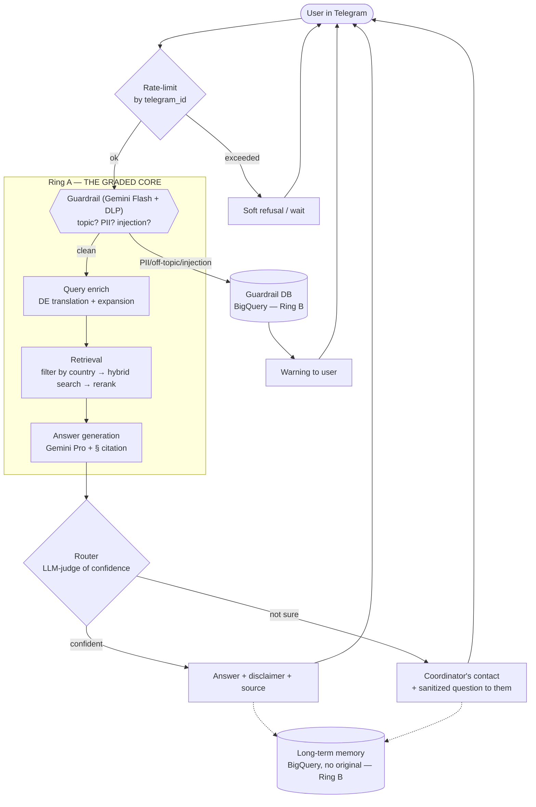

# Review of the idea, materials, and flow

> Covers your requests: "overall evaluation of the idea and materials" + "review of my flow and suggestions for changes".

---

## Part 1. Evaluation of the idea

### What's good (strengths for grading)

1. **A real problem with real pain.** Belarusian refugees genuinely get lost in foreign law in a foreign language. The assignment explicitly asks for a problem "from your work or daily life." Yours is alive, not invented — a plus for sections 1 (5%) and 5 (pitch, 10%), where story and empathy are valued.

2. **A pure RAG-shaped task.** This is exactly the case RAG was built for: a large corpus of unchanging documents (laws) + questions whose answers MUST rely on a source, not on the model's imagination. The legal domain = high cost of hallucination = grounding is mandatory. This is your main argument for "why RAG, and not just ChatGPT."

3. **You already have a golden test set.** 13 question-answer pairs in Russian with real answers from a human (Anastasia). Most students at this stage have nothing. This is your foundation for Evaluation. Everyday analogy: you're building a chef-robot and you already have 13 dishes from a head chef to compare against. A huge head start.

4. **Ethical design (no-PII) is not only correct, it sells.** "We deliberately do not store refugees' personal data" is a strong pitch slide and a real competitive advantage (refugees fear surveillance). It's good that you're thinking about this from the very start.

### What raises risks (honestly)

1. **Scope.** Already said in `00`: 7 nodes + 3 memory types + bans + DDOS + human handoff cannot be built to production quality solo in a week. The risk is spreading yourself thin and not bringing the RAG (50% of the grade) to a measurable result.

2. **Cross-lingual gap.** Laws are in German, cases in Russian, questions in Russian/Belarusian, reference answers in Russian. This is technically more interesting than ordinary RAG, but also harder: the embedding must "understand" that a Russian question about a residence permit and the German §NAG are about the same thing. It is solvable (see `03`), but it's a risk for accuracy, and it must be measured separately.

3. **Legal liability.** You give people legal advice. You need an explicit disclaimer ("this is not legal advice, verify with a specialist") and routing of hard cases to a human. It's good that routing to a coordinator is already in your diagram — it closes the risk both ethically and in the instructor's eyes.

4. **Corpus quality = ceiling of answer quality.** Right now "Court decisions" is empty, there's no data for Lithuania, and laws sit as PDF/RTF (not the friendliest format for RAG). RAG is not smarter than its documents. More on this in Part 2.

### Verdict on the idea

The idea is one of the best you can pick for this assignment: real, RAG-natural, with a ready test set and a strong ethical story. The main threat is not in the idea but in scope discipline. Build the core, don't chase all the nodes.

---

## Part 2. Evaluation of the prepared materials

What's currently in `docs/Austria`:

| Folder / file | Content | State | Note |
|---|---|---|---|
| `Laws/` | NAG, FPG §88, StbG — laws (German) | PDF + RTF + xlsx of sources | Core of the corpus. Format must be normalized (see `03`). |
| `Cases/` | 2 anonymized cases, Russian | docx | Valuable: links "dry law" to a "living situation." Excellent material for contextual chunking. |
| `Court decisions/` | — | **empty** | Either populate it, or honestly mark it as "out of POC scope." |
| `Test Qs.xlsx` | 13 Q&A pairs, Russian | filled in | Your golden set. A bit small for statistics, but enough for a POC. Expand to ~30-50 with synthetics. |
| `Weblinks.docx`, `Sources.xlsx` | links to primary sources (RIS, JUSLINE) | present | Useful for NotebookLM (see `05`) and for "source" metadata. |

Recommendations on materials:

1. **13 questions is a working minimum, but expand to 30-50.** How: run the laws through Gemini with a prompt "generate realistic refugee questions + an answer strictly from this text with a reference to the paragraph." You'll get a synthetic eval set. Important: keep the synthetic SEPARATE from the 13 "human" ones — the human ones are your "sacred" benchmark, the synthetic is for volume. (Analogy: 13 exam problems from the professor + 40 problems from a workbook for practice. Don't mix them.)

2. **Normalize the laws from PDF/RTF into Markdown while preserving the structure of paragraphs (§).** Legal text rests on the hierarchy "§ → paragraph → item." If chunking tears §88 in half, the answer will be incomplete. PDF returns structure poorly; see tools in `03`.

3. **Metadata is your two-stage advantage.** You designed it right: first filter by country, then search within. Add metadata to each document/chunk: `country` (AT), `doc_type` (law/case/decision), `law_code` (NAG/FPG/StbG), `paragraph` (§88), `lang` (de/ru), `source_url`. This gives both filtering and answer citability ("according to §88 FPG..."). A source citation is a killer feature for a legal bot and a direct answer to "add answer validation: quote the source" from the methodology.

4. **"Court decisions" — decide now.** Court decisions greatly increase usefulness (precedents), but searching/filtering them is a separate large project (you write this yourself regarding NotebookLM). Advice: mark it scope-out for the POC; in `05` I provide a NotebookLM prompt so you can find sources for the future.

---

## Part 3. Critical review of your flow

Your diagram (`[AI]mbassy pipeline.drawio.png`) is logical and well thought out. But there are three places I, as a mentor, would rearrange — they add complexity without proportional payoff over a week.

### Note 1 — "ReAct" is in the wrong place

Your flow is: `Guardrails → ReAct → Prompt enrich → RAG → LLM`. Two different paradigms are mixed here.

- **ReAct** is an agent that decides ITSELF which tool to call (search, calculator, retriever) and loops "thought → action → observation → thought." This is powerful but expensive in tokens, slow, and harder to debug.
- **A linear RAG pipeline** is a fixed pipe: rewrite the query → retrieve chunks → generate the answer → check it. Predictable, fast, easy to measure.

Everyday analogy: ReAct is a free-roaming detective who decides for himself where to go and whom to interrogate. Linear RAG is a factory conveyor where each station does its job. For a one-week POC on factual legal questions, **the conveyor is almost always better**: questions like "how long do I wait for asylum" don't require multi-step reasoning with tools.

**Recommendation:** remove ReAct from the main flow. Make linear RAG. If evaluation shows there are "multi-step" questions (e.g., "if I have X and Y, and I already applied for Z, then…"), then you add agentic behavior pointwise. That is exactly "improve one dimension" based on results, not in advance.

### Note 2 — "Prompt enrich" and the clarifying-question loop

The idea of enriching the query is correct. But an interactive loop "the bot asks clarifying questions → waits for an answer → continues" requires dialogue state management (your "flow state memory"). It's doable in LangGraph, but it's +1 day of work and +1 source of bugs.

**Recommendation for the core:** on the first pass, do **non-interactive** enrichment in one step. What goes into it and why is in `03`, but briefly: (a) translating/expanding the query into German for better matching against the laws (cross-lingual bridge), (b) adding synonyms of legal terms. Interactive clarifications are Ring C — you'll add them if time remains.

### Note 3 — "Destructive checks" is not GenAI, don't waste LLM time on it

"Protection from a mass bot attack" and "DDOS" are infrastructure engineering, not a language model's task. You don't need to call an LLM to figure out that a user sent 500 messages in a minute.

**Recommendation:** implement it as a simple rate-limit by `telegram_id` (a counter in memory/Redis/BigQuery: N messages per T seconds → a soft refusal). Escalating bans — describe them in the architecture, but don't build them over a week. But a CHEAP topic prefilter (Gemini Flash-Lite, pennies per call) BEFORE expensive Pro generation is the proper "destructive check" in the economy sense: it cuts off "write me a poem" before you spend the expensive RAG+Pro. This merges with Guardrails.

### What's good in your flow and should stay

- **The "filter cheaply → process expensively" order** is the right economy instinct. Keep it.
- **PII redaction BEFORE logging and working only with the sanitized query** is excellent — both ethics and compliance. Just use a specialized tool (Google DLP), not only an LLM (see `02`).
- **Router with human handoff to a coordinator** is great. This is your "fallback for unanswered questions" from the methodology, framed socially. Keep it, implement it simply (an LLM-judge of confidence).
- **Citing the source country via metadata** — keep it, it's a strength.

---

## Part 4. Proposed corrected flow (for the POC)

Linear, predictable, measurable. Ring A nodes are highlighted; B and C are marked.

Main differences from your diagram:
1. ReAct removed from the main flow (Ring C — add based on eval results).
2. Rate-limit is a simple counter, not an LLM.
3. Guardrail is one node: DLP (PII) + Gemini Flash (topic/injection).
4. Enrich is one non-interactive step (translation + expansion).
5. Retrieval is decomposed into its sub-stages (country filter → hybrid → rerank).
6. The color/rings show what to build now and what to describe.

Next — `02` (concrete stack per node with alternatives).
